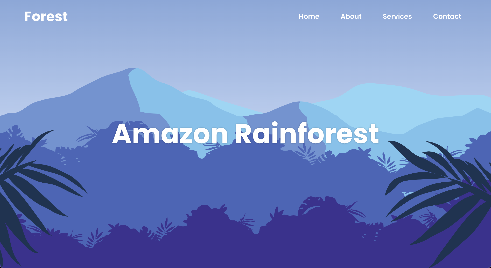
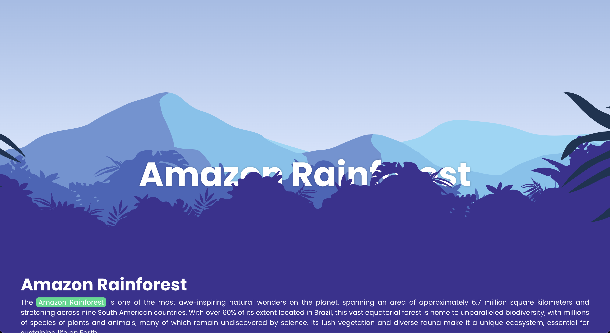
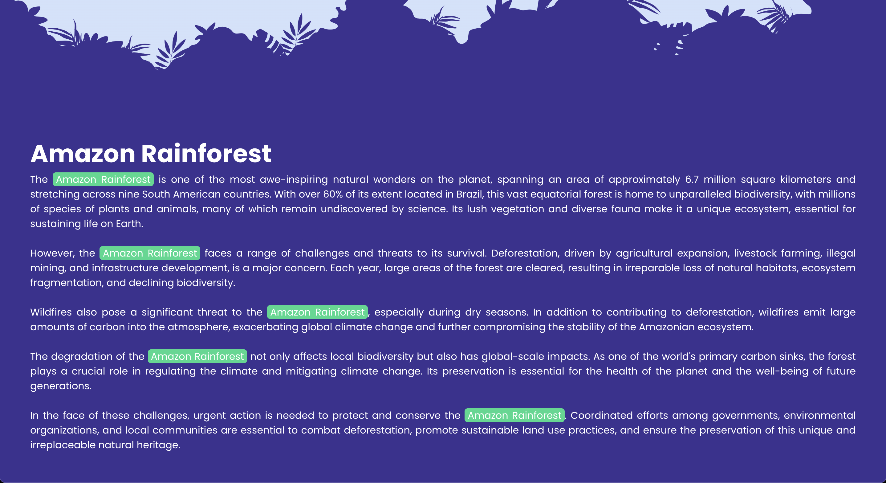

<h1 align="center">Amazon Rainforest</h1>

<p align="center">Using HTML, CSS, and JavaScript, we've created an immersive experience with the parallax effect. Scroll down to discover the beauty and importance of the rainforest. Join us in celebrating and preserving this natural wonder!</p>

<br />

## Screenshots

#### Home



#### Effect Parallax



#### Content



<br />

## Running the Application

<a href="https://amazon-rainforest.netlify.app" target="_blank">Access the Project's website by clicking here.</a>

```
https://amazon-rainforest.netlify.app
```

<br />
<i>Follow the steps to run the Project on your local machine.</i>
<br />

#### Requirements

- [Browser of your choice](https://www.google.com/chrome/)

#### Clone the repository and navigate to the folder

```
$ git clone https://github.com/MatheusPalmieri/amazon-rainforest && cd amazon-rainforest
```

#### Run local project

```
$ open index.html
```

<i>Open index.html in the browser to view.</i>

<br />

## Technologies

<p>The following tools were used in the project:</p>

**Frontend**: HTML, CSS and JavaScript.

<br />

## License

This project is licensed under the [MIT License](LICENSE).

<br />

## Author

Created by <b>`Matheus Palmieri`</b>👨‍💻

<br />

<p align=\"center\">🌳 Amazon Rainforest 🌵</p>
